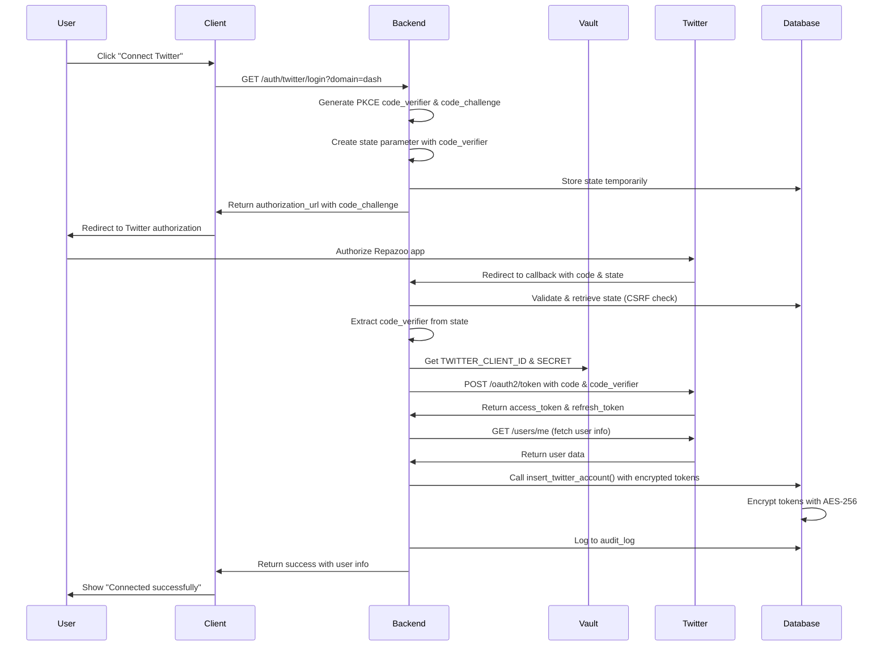

# Repazoo Twitter OAuth 2.0 PKCE Implementation

Complete Twitter OAuth 2.0 authentication flow with PKCE (Proof Key for Code Exchange), secure token management, and encrypted storage.

## Architecture Overview

```
┌─────────────┐         ┌──────────────┐         ┌─────────────┐
│   Client    │  ────>  │   FastAPI    │  ────>  │  Supabase   │
│  (Browser)  │         │  OAuth Flow  │         │  Database   │
└─────────────┘         └──────────────┘         └─────────────┘
       │                       │                         │
       │                       │                         │
       v                       v                         v
┌─────────────┐         ┌──────────────┐         ┌─────────────┐
│   Twitter   │  <────  │  PKCE Code   │         │  Encrypted  │
│  OAuth API  │         │  Verifier    │         │   Tokens    │
└─────────────┘         └──────────────┘         └─────────────┘
                               │
                               v
                        ┌──────────────┐
                        │ Vault System │
                        │ (Credentials)│
                        └──────────────┘
```

## Security Features

### 1. PKCE (Proof Key for Code Exchange)
- **Code Verifier**: 128-byte cryptographically random string
- **Code Challenge**: SHA-256 hash of code verifier
- **Protection**: Prevents authorization code interception attacks

### 2. State Parameter (CSRF Protection)
- **Random State ID**: 32-byte URL-safe random string
- **Expiration**: 10-minute validity window
- **One-Time Use**: States are deleted after validation
- **Storage**: Temporary database storage with automatic cleanup

### 3. Token Encryption
- **Algorithm**: AES-256-CBC with PKCS padding
- **Key Management**: Encryption key from environment/vault
- **Storage**: Database functions `encrypt_token()` and `decrypt_token()`
- **Access Control**: Service role only can decrypt tokens

### 4. Audit Logging
All OAuth operations are logged to `audit_log` table:
- `OAUTH_INITIATED`: Authorization flow started
- `OAUTH_CONNECT`: Successful account connection
- `OAUTH_DISCONNECT`: Account disconnection
- `TOKEN_REFRESHED`: Access token refreshed

### 5. Multi-Domain Support
Supports callbacks for all Repazoo domains:
- `api.repazoo.com`
- `cfy.repazoo.com` (Clarification/CFY)
- `ntf.repazoo.com` (Notification)
- `ai.repazoo.com` (AI Analytics)
- `dash.repazoo.com` (Dashboard)

## File Structure

```
backend/auth/
├── __init__.py           # Module exports
├── config.py             # OAuth configuration & vault integration
├── models.py             # Pydantic models for requests/responses
├── oauth_handler.py      # Core OAuth logic with PKCE
├── routes.py             # FastAPI endpoints
└── README.md            # This file

backend/
├── main.py              # FastAPI application
├── requirements.txt     # Python dependencies
└── .env.example         # Environment configuration template
```

## API Endpoints

### 1. Initiate OAuth Flow
```http
GET /auth/twitter/login?domain=dash&redirect_after_auth=https://dash.repazoo.com/settings
```

**Response:**
```json
{
  "authorization_url": "https://twitter.com/i/oauth2/authorize?...",
  "state": "random-state-id",
  "expires_at": "2025-10-07T19:05:00Z"
}
```

**Usage:**
1. Client calls this endpoint
2. Client redirects user to `authorization_url`
3. User authorizes app on Twitter
4. Twitter redirects to callback URL

---

### 2. OAuth Callback
```http
GET /auth/twitter/callback?code=AUTH_CODE&state=STATE_ID&domain=dash
```

**Response:**
```json
{
  "success": true,
  "twitter_account_id": "uuid-here",
  "twitter_user": {
    "id": "12345",
    "username": "johndoe",
    "name": "John Doe"
  },
  "redirect_url": "https://dash.repazoo.com/settings"
}
```

**Flow:**
1. Twitter redirects to this endpoint with authorization code
2. Backend validates state parameter (CSRF check)
3. Backend exchanges code for tokens using PKCE
4. Backend fetches Twitter user information
5. Backend stores encrypted tokens in database
6. Returns success with user details

---

### 3. Check Authentication Status
```http
GET /auth/twitter/status
Authorization: Bearer <jwt-token>
```

**Response:**
```json
{
  "authenticated": true,
  "twitter_accounts": [
    {
      "id": "12345",
      "username": "johndoe",
      "name": "John Doe"
    }
  ],
  "token_expires_at": "2025-10-07T21:00:00Z",
  "scopes": ["tweet.read", "tweet.write", "users.read", "offline.access"]
}
```

---

### 4. Revoke OAuth Access
```http
POST /auth/twitter/revoke
Authorization: Bearer <jwt-token>
Content-Type: application/json

{
  "twitter_account_id": "uuid-here"
}
```

**Response:**
```json
{
  "success": true,
  "message": "Twitter account successfully disconnected"
}
```

---

### 5. Refresh Access Token
```http
POST /auth/twitter/refresh/{account_id}
Authorization: Bearer <jwt-token>
```

**Response:**
```json
{
  "success": true,
  "message": "Token refreshed successfully"
}
```

**Note:** Token refresh is typically handled automatically when tokens expire.

## OAuth Flow Sequence

### Complete PKCE Flow



## Configuration

### Environment Variables

Create `/root/repazoo/backend/.env`:

```bash
# Supabase
SUPABASE_URL=https://your-project.supabase.co
SUPABASE_SERVICE_ROLE_KEY=your-service-role-key

# Database Encryption
DB_ENCRYPTION_KEY=your-32-byte-base64-key

# Optional: Override vault credentials
# TWITTER_CLIENT_ID=your-client-id
# TWITTER_CLIENT_SECRET=your-client-secret
```

### Vault Configuration

Twitter credentials are loaded from vault:
- **Location**: `/root/.repazoo-vault/secrets/twitter-credentials.json.age`
- **Script**: `/root/.repazoo-vault/scripts/vault-get-secret.sh`
- **Service Name**: `repazoo-oauth-service`

**Required Secrets:**
- `TWITTER_CLIENT_ID`
- `TWITTER_CLIENT_SECRET`

**ACL Configuration:**
Add to `/root/.repazoo-vault/secrets/access-control.json`:
```json
{
  "rules": [
    {
      "service": "repazoo-oauth-service",
      "secrets": ["TWITTER_CLIENT_ID", "TWITTER_CLIENT_SECRET"],
      "permissions": ["read"]
    }
  ]
}
```

## Database Setup

### 1. Apply Migrations

```bash
cd /root/repazoo
psql $DATABASE_URL -f supabase/migrations/20251007_001_initial_schema.sql
psql $DATABASE_URL -f supabase/migrations/20251007_002_encryption_functions.sql
psql $DATABASE_URL -f supabase/migrations/20251007_005_oauth_state_table.sql
```

### 2. Set Encryption Key

```sql
-- Set database encryption key (use same as DB_ENCRYPTION_KEY)
ALTER DATABASE your_database SET app.settings.encryption_key = 'your-key-here';
```

### 3. Verify Setup

```sql
SELECT * FROM public.verify_encryption_setup();
```

Should return:
```
test_name                    | status | details
-----------------------------+--------+------------------------------------------
Encryption Key Retrieval     | PASS   | Encryption key successfully retrieved
Token Encryption             | PASS   | Token successfully encrypted
Token Decryption             | PASS   | Token successfully decrypted and matches
pgcrypto Extension           | PASS   | pgcrypto extension is installed
```

## Installation

### 1. Install Dependencies

```bash
cd /root/repazoo/backend
pip install -r requirements.txt
```

### 2. Configure Environment

```bash
cp .env.example .env
# Edit .env with actual values
```

### 3. Run Application

```bash
# Development
python main.py

# Production (with Gunicorn)
gunicorn main:app -w 4 -k uvicorn.workers.UvicornWorker -b 0.0.0.0:8000
```

### 4. Test Endpoints

```bash
# Health check
curl http://localhost:8000/health

# OAuth health
curl http://localhost:8000/auth/twitter/health

# API documentation
open http://localhost:8000/docs
```

## Usage Examples

### Python Client

```python
import requests

# 1. Initiate OAuth flow
response = requests.get(
    "https://api.repazoo.com/auth/twitter/login",
    params={"domain": "dash", "redirect_after_auth": "https://dash.repazoo.com/settings"}
)
auth_data = response.json()

# Redirect user to auth_data["authorization_url"]

# 2. After callback, check status
response = requests.get(
    "https://api.repazoo.com/auth/twitter/status",
    headers={"Authorization": f"Bearer {jwt_token}"}
)
status = response.json()
print(f"Authenticated: {status['authenticated']}")
print(f"Twitter accounts: {status['twitter_accounts']}")
```

### JavaScript Client

```javascript
// 1. Initiate OAuth flow
const response = await fetch(
  'https://api.repazoo.com/auth/twitter/login?domain=dash'
);
const { authorization_url } = await response.json();

// Redirect user
window.location.href = authorization_url;

// 2. After callback, check status (with JWT)
const statusResponse = await fetch(
  'https://api.repazoo.com/auth/twitter/status',
  {
    headers: {
      'Authorization': `Bearer ${jwtToken}`
    }
  }
);
const status = await statusResponse.json();
console.log('Connected accounts:', status.twitter_accounts);
```

## Token Management

### Automatic Token Refresh

Tokens are refreshed automatically before expiration. The OAuth handler includes:

```python
async def refresh_access_token(account_id: str) -> bool:
    # Gets refresh token from database (encrypted)
    # Requests new access token from Twitter
    # Updates database with new tokens
    # Logs refresh event to audit_log
```

**Recommended Strategy:**
- Check token expiration before each Twitter API call
- Refresh if expiring within 5 minutes
- Implement retry logic with token refresh on 401 errors

### Manual Token Refresh

```bash
curl -X POST https://api.repazoo.com/auth/twitter/refresh/{account_id} \
  -H "Authorization: Bearer ${JWT_TOKEN}"
```

## Troubleshooting

### Common Issues

#### 1. Vault Access Denied
```
Error: Access denied: repazoo-oauth-service is not authorized
```

**Solution:** Add service to vault ACL:
```bash
# Edit /root/.repazoo-vault/secrets/access-control.json
# Add repazoo-oauth-service with TWITTER_* permissions
```

#### 2. Encryption Key Not Found
```
Error: Encryption key not configured
```

**Solution:** Set `DB_ENCRYPTION_KEY` environment variable or configure database setting:
```sql
ALTER DATABASE your_db SET app.settings.encryption_key = 'your-key';
```

#### 3. Invalid State Parameter
```
Error: Invalid or expired state parameter
```

**Causes:**
- State expired (> 10 minutes)
- State already used
- Database connection issue

**Solution:** Ensure `oauth_states` table exists and retry flow.

#### 4. Token Exchange Failed
```
Error: Token exchange failed: invalid_grant
```

**Causes:**
- Authorization code already used
- Code verifier mismatch
- Expired authorization code

**Solution:** Restart OAuth flow from beginning.

## Security Considerations

### Production Deployment

1. **Use HTTPS Only**: All endpoints must use HTTPS in production
2. **Rotate Keys Regularly**: Rotate DB_ENCRYPTION_KEY periodically
3. **Monitor Audit Logs**: Set up alerts for suspicious OAuth activity
4. **Rate Limiting**: Implement rate limits on OAuth endpoints
5. **IP Allowlisting**: Consider IP restrictions for OAuth callbacks
6. **Secrets Management**: Never commit `.env` or credentials to git

### Security Checklist

- [ ] HTTPS enforced on all domains
- [ ] Vault ACL configured properly
- [ ] Database encryption key set and secure
- [ ] RLS policies enabled on `oauth_states` table
- [ ] Audit logging monitored
- [ ] Token expiration < 2 hours
- [ ] Refresh tokens rotated on use
- [ ] State expiration = 10 minutes
- [ ] CORS origins restricted to Repazoo domains only

## Support

For issues or questions:
1. Check audit logs: `SELECT * FROM audit_log WHERE action LIKE 'OAUTH_%' ORDER BY created_at DESC LIMIT 10;`
2. Verify vault access: `/root/.repazoo-vault/scripts/vault-get-secret.sh TWITTER_CLIENT_ID repazoo-oauth-service`
3. Test encryption: `SELECT * FROM verify_encryption_setup();`

## License

Proprietary - Repazoo SaaS Platform
